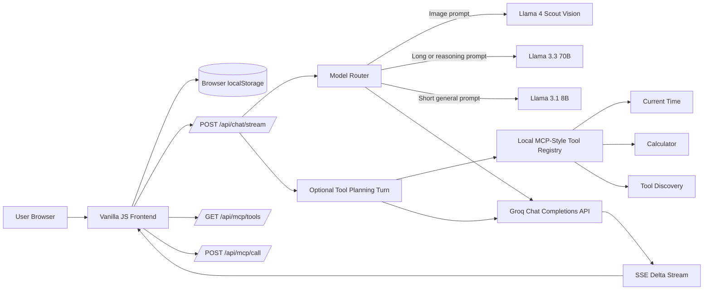

# Beno GPT v2 Architecture

## Request Flow

1. The frontend builds a message payload from the active chat, selected image, memory-turn setting, custom system prompt, and saved long-term memories.
2. The payload is sent to `/api/chat/stream` with either a fixed model id or `model: "auto"`.
3. The server chooses a model when auto routing is enabled.
4. If MCP tools are enabled, the server first asks the model whether a local tool is needed.
5. Requested tools are executed server-side and returned to the model as tool results.
6. The final model answer is streamed back to the browser as server-sent events.
7. The frontend renders deltas live and saves the completed assistant message in localStorage.

## Long-Term Memory

Long-term memories are explicit user-saved notes. They are stored in `localStorage` under `beno-gpt-memory-v1` and also included in chat export files. During each request, up to 30 memories are added to the system context under `Long-term memory from previous sessions`.

## MCP-Style Tools

The project uses a local MCP-style registry instead of an external MCP process so the homework can run with only Node.js:

- `GET /api/mcp/tools` lists available tools and schemas.
- `POST /api/mcp/call` executes a tool directly.
- `POST /api/chat/stream` can let the model call those same tools before generating the final answer.

Current tools:

- `get_current_time`: returns the current date/time for an IANA timezone.
- `calculate`: evaluates a safe arithmetic expression.
- `list_available_tools`: lists registered local tools.
